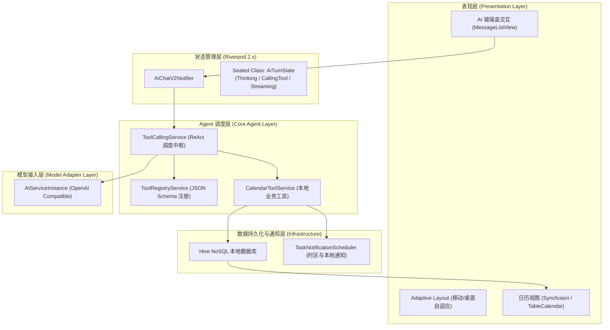

# 📅 Barklendar

> **Barklendar** 是一款基于 **Flutter (Dart 3)** 开发的跨平台 AI 智能日程管理应用。通过结合大模型 **Function Calling（工具调用）** 与端侧 **ReAct 自主循环**，实现自然语言多轮交互排程、离线 NoSQL 数据持久化与系统级定时提醒。

---

## 🌟 核心特性 (Key Features)

- 🤖 **自然语言智能排程 (AI Task Scheduling)**：基于 OpenAI 兼容的 Function Calling 机制，自动从自然语言对话中提取标题、时间、优先级等字段，完成日历事件的增删改查。
- 🔄 **端侧 ReAct 调度闭环 (ReAct Agentic Workflow)**：内置 `ToolCallingService`，实现「意图识别 $\rightarrow$ 参数校验 $\rightarrow$ 本地 CRUD 执行 $\rightarrow$ 结果回传 $\rightarrow$ 自然语言答复」的多轮自愈交互。
- 👁️ **玻璃盒交互状态机 (Observable UX State Machine)**：基于 Dart 3 `sealed class` 强类型建模（思考中、工具执行中、打字机流式输出中），提供透明的 AI 决策可视化。
- 🖥️ **跨平台自适应布局 (Cross-Platform Adaptive UI)**：使用 `AdaptiveScaffold` 与 `window_manager`，一套代码自适应运行于 macOS / Windows 桌面端与 iOS / Android 移动端。
- 💾 **离线毫秒级持久化 (Offline Hive NoSQL)**：采用嵌入式二进制序列化存储，保障高频日历视图的流畅渲染。
- ⏰ **时区感知与本地通知 (Smart Local Reminders)**：集成 `flutter_local_notifications` 与 `timezone`，支持全天/限时任务的动态时间偏移计算与离线定时推送。

---

## 🏗️ 系统架构 (Architecture)



---

## 🛠️ 技术栈 (Tech Stack)

| 模块 | 核心技术选型 |
| :--- | :--- |
| **基础框架** | Flutter 3.x / Dart 3.x |
| **状态管理** | Flutter Riverpod 2.x (`StateNotifier`, `Provider`) |
| **网络通信** | Dio 5.x |
| **本地存储** | Hive 2.x / Hive Flutter (TypeAdapter 二进制序列化) |
| **日历组件** | Syncfusion Flutter Calendar / Table Calendar |
| **系统通知** | `flutter_local_notifications` + `timezone` |
| **多端自适应** | `flutter_adaptive_scaffold` + `window_manager` |
| **主题国际化** | FlexColorScheme / Flutter Localizations (中/英/日/韩) |

---

## 📁 目录结构 (Project Structure)

```text
barklendar/
├── changelog.md
└── flutter_calendar/
    ├── lib/
    │   ├── dao/                # 数据访问对象与主题持久化
    │   ├── enums/              # 枚举定义
    │   ├── l10n/               # 国际化多语言配置 (ARB 文件)
    │   ├── models/             # 数据模型 (Task, ToolDefinition, Sealed AiTurnState)
    │   ├── pages/              # 页面 (日历、任务列表、AI 对话、配置中心)
    │   ├── providers/          # Riverpod 状态提供者
    │   ├── repositories/       # 数据仓储层 (Local / API 抽象)
    │   ├── router/             # GoRouter 路由管理
    │   ├── services/           # 核心服务 (ToolCallingService, HiveService, NotificationService)
    │   ├── theme/              # 全局主题配置 (Material 3)
    │   ├── utils/              # 工具函数 (通知调度器、日期处理、Logger)
    │   ├── widgets/            # 复用组件 (日历视图、消息气泡、输入框)
    │   └── main.dart           # 应用启动入口
    ├── pubspec.yaml            # 依赖管理
    └── README.md
```

---

## 🚀 快速上手 (Getting Started)

### 1. 环境准备
* 安装 [Flutter SDK](https://docs.flutter.dev/get-started/install) (>= 3.0.0)
* 配置 Dart 环境

### 2. 获取源码并安装依赖
```bash
git clone https://github.com/YOUR_USERNAME/barklendar.git
cd barklendar/flutter_calendar
flutter pub get
```

### 3. 生成 Hive 序列化适配器代码 (可选)
```bash
flutter pub run build_runner build --delete-conflicting-outputs
```

### 4. 运行应用
```bash
# 启动 macOS 桌面端
flutter run -d macos

# 或启动 Chrome Web 端 / 模拟器
flutter run -d chrome
```

### 5. 配置 AI 服务
启动应用后进入 **设置 -> AI 服务配置**，填入你的 OpenAI / DeepSeek 等兼容大模型的 API Key 与 Endpoint 即可启用自然语言日程排程。

---

## 📄 License
This project is open-sourced under the [MIT License](LICENSE).
